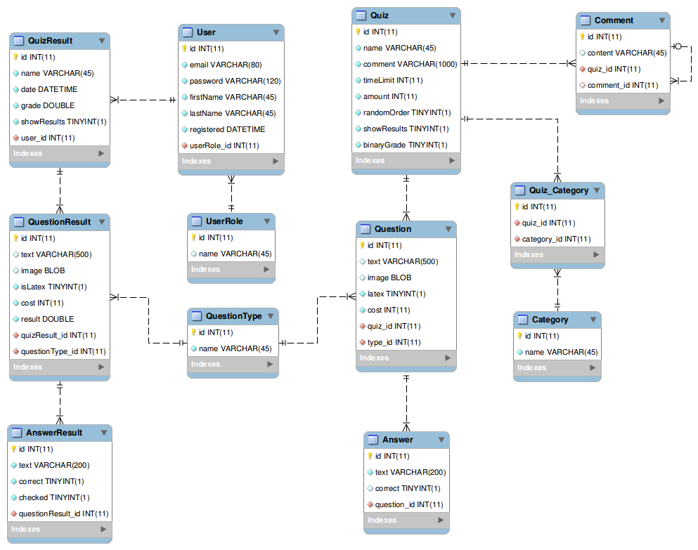

QuizTest
========

###### BIONIC University, JavaEE October 2013. Course project.  
QuizTest is an online quiz system, useful for quiz, tests, exams.

### Demo
The application has been published onto OpenShift for easy access:  
[Main page](https://quiztest-riaval.rhcloud.com/QuizTestWebUser/faces/index.xhtml)  
[Quiz which may be of interest](https://quiztest-riaval.rhcloud.com/QuizTestWebUser/faces/test.xhtml?id=46)
```
usename: demo@example.com
password: password
```
[Admin panel](https://quiztest-riaval.rhcloud.com/QuizTestWebAdmin/faces/signin.xhtml)
```
usename: admin@example.com
password: password
```

### Used technologies
* EJB 3
* JPA/JPQL
* JSF/Primefaces
* HTML/CSS, Twitter bootstrap 2

### Database schema


### Main features

1. Time bound/unlimited time quiz
2. Random selection of questions
3. Special binary type for multiple questions
4. Questions categories
5. User restriction for a quiz
6. Saving progress during passing the quiz
7. Optional detailed reports
8. Detailed Admin section

